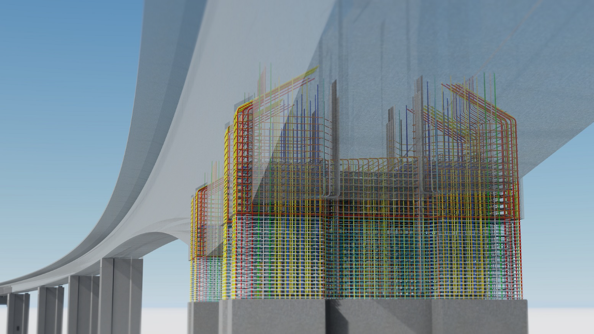

# 3维数据认知——BIM

- [什么是BIM](#概念)
- [等级](#等级)
- [bim数据分析](#数据格式)

# 概念

`BIM`(Building Information Modeling)是**建筑信息模型**或**建筑信息管理**的首字母缩写词。[建筑信息模型](https://www.designingbuildings.co.uk/wiki/Building_Information_Modelling)( [BIM](https://www.designingbuildings.co.uk/wiki/Bim) ) 是一个非常广泛的术语，它描述了[指定](https://www.designingbuildings.co.uk/wiki/Specifying)、创建和管理有关[建筑资产](https://www.designingbuildings.co.uk/wiki/Built_asset)（如[建筑物](https://www.designingbuildings.co.uk/wiki/Building)、[桥梁](https://www.designingbuildings.co.uk/wiki/Bridge)、[高速公路](https://www.designingbuildings.co.uk/wiki/Highways)或[隧道）的](https://www.designingbuildings.co.uk/wiki/Tunnel)[数字信息](https://www.designingbuildings.co.uk/wiki/Digital_information)的过程。

# 等级

不同类型的项目可以实现不同级别的BIM。每个级别代表一组不同的标准，这些标准展示了特定的“成熟度”级别。BIM 级别从 0 开始，然后到 4D、5D 甚至[6D BIM](https://en.wikipedia.org/wiki/6D_BIM)。这些级别的目的是衡量在整个过程中共享和管理信息的有效性或信息量。

那么每个级别涉及什么，您如何确定您在哪个级别工作？以下是前三个级别的简要说明以及每个阶段涉及的标准的说明。

## 0级BIM：纸质图纸+零协作

0 级 BIM 是指根本不协作操作。如果您使用2D CAD 并使用绘图和/或数字打印，您可以肯定地说您处于 0 级。今天，大多数行业都在这个级别之上工作，尽管并非行业中的每个专业人士都有足够的 BIM培训和一些项目不包括在合同规范中使用 BIM。

## Level 1 BIM：2D施工图+一些3D建模

使用 3D CAD 进行概念工作，但使用 2D 绘制生产信息和其他文档，这可能意味着您正在使用 [1 级 BIM](https://www.thenbs.com/knowledge/bim-levels-explained)。在此级别，CAD 标准按照[BS 1192:2007](http://bim-level2.org/en/standards/)标准进行管理，并且从通常由承包商管理的通用数据环境 (CDE) 中进行数据的电子共享。许多公司处于 1 级 BIM，这不涉及太多协作，每个利益相关者都发布和管理自己的数据。

## 2 级 BIM：团队在自己的 3D 模型中工作

[2 级 BIM](http://bim-level2.org/)开始添加到协作环境中。BIM 2 级实际上是 2016 年 4 月对英国所有公开招标项目的强制性要求。法国紧随其后，于 2017 年获得了自己的授权。

在第 2 级，所有团队成员都使用 3D CAD 模型，但有时不在同一个模型中。但是，利益相关者交换信息的方式使其与其他级别有所不同。有关建筑环境设计的信息通过通用文件格式共享。

当公司将其与自己的数据相结合时，他们可以节省时间、降低成本并消除返工的需要。由于以这种方式共享数据，因此 CAD 软件必须能够导出为通用文件格式，例如[IFC（工业基础类）](https://en.wikipedia.org/wiki/Industry_Foundation_Classes)或[COBie（施工运营建筑信息交换）](https://www.wbdg.org/resources/construction-operations-building-information-exchange-cobie)。

## 3 级 BIM：团队使用共享的 3D 模型

BIM 3 级更具协作性。不是每个团队成员都在自己的 3D 模型中工作，第 3 级意味着每个人都使用一个共享的项目模型。该模型存在于“中央”环境中，每个人都可以访问和修改。这被称为[Open BIM](http://www.openbim.org/)，这意味着增加了另一层保护以防止冲突，从而在每个阶段为项目增加价值。 

3 级 BIM 的好处是：

- 整个项目的更好的 3D 可视化
- 多个团队和行业之间的轻松协作
- 简化设计意图的沟通和理解
- 减少项目每个阶段的返工和修订

## 4、5 和 6 级 BIM：添加调度、成本和可持续性信息

BIM 4 级为信息模型带来了一个新元素：时间。此信息包括帮助概述项目每个阶段将花费多少时间或各种组件排序的调度数据。 

*在通用数据环境中查看 5D BIM 模型，以根据浇筑数运行结构排序分解*

# 数据格式

`BIM`文件后缀可不是`.bim`哦！`BIM` 是一个过程、一种方法，而 `Revit` 是一款支持`BIM`的软件。所以导出的文件后缀名可以是`.rvt`。除了`.rvt`后缀名外，还可以使用`.Ifc`、`.dwg`、`.dgn`等的后缀名。

## `Revit`工具

## Revit：面向设计师、建筑师和实干家的 BIM 软件

`Revit`是一款面试设计师，建筑师的`BIM`软件，常用于三维建模、简化文档编制，在统一的 `BIM` 环境中使用专用工具。

### 特点

- **使用参数对象**- 每个组件都具有参数质量。
- **快速更改，无重复**- 每当对模型进行更改时，软件会自动更新每个相关组件，从而影响整个建筑模型、文档、细节等。
- **施工文件**- 高质量的文件 - 从 3D 模型自动生成。
- **数量和成本估算**- 从插入的数据自动生成。
- **协调**- 共享模型使团队能够有效协作并减少冲突。
- **3D 可视化**- 允许与客户和您的团队更好地沟通。
- **互操作性**- Revit 导入 - 导出 - 将您的数据与 IFC 等常用格式链接。
