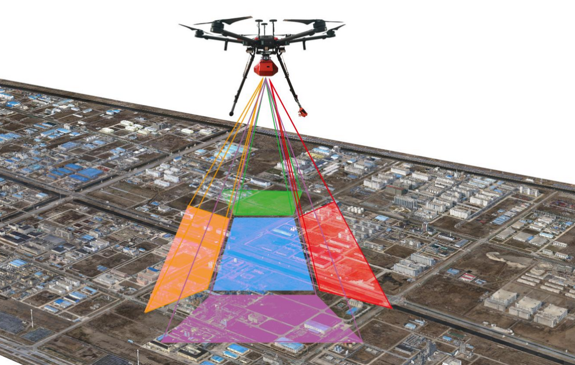
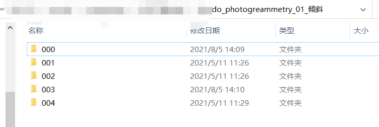
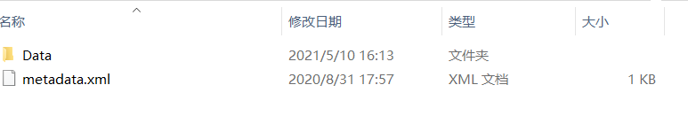
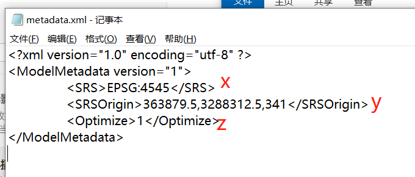
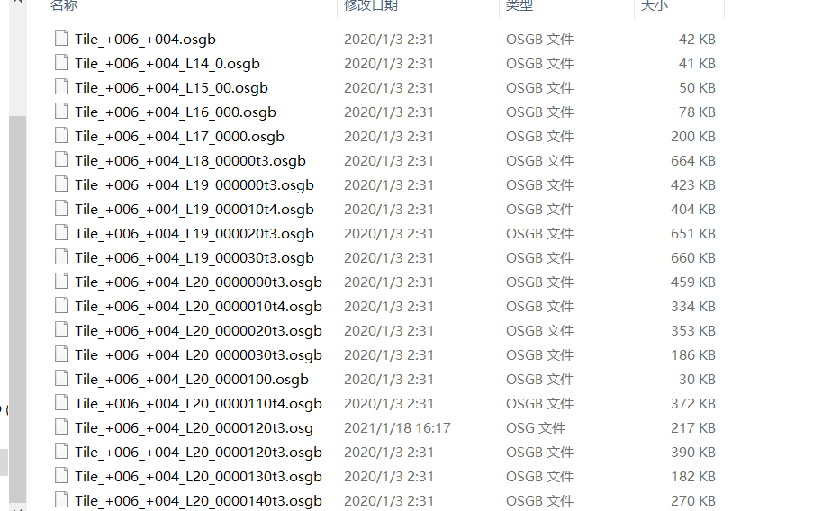

# 3维数据认知——倾斜摄影

在上一期文章中介绍了地形影像，本期来聊聊**倾斜摄影**。

这里主要分为以下几个部分：

- [倾斜摄影概念](#概念)
- [倾斜摄影的应用](#应用)
- [倾斜摄影的数据表现形式](#数据表现形式)
- [拓展](#拓展)

# 概念

相对起地形影像，倾斜摄影会比较好理解，简单的说是： **无人机通过多颗摄像头拍在出来的数据**.

从百度百科和维基百科来看的是：

倾斜摄影技术是国际测绘领域近些年发展起来的一项高新技术，它颠覆了以往[正射影像](https://baike.baidu.com/item/正射影像)只能从垂直角度拍摄的局限，通过在同一飞行平台上搭载**多台传感器**，同时从**一个垂直**、**四个倾斜**等五个不同的角度采集影像，将用户引入了符合人眼视觉的真实直观世界。是不是感觉这的话有点晦涩难懂。那就来张图看看：

# 应用

由于倾斜摄影不仅能够真实地反映地物情况，高精度地获取物方纹理信息，还可通过先进的**定位**、**融合**、**建模**等技术，生成真实的三维城市模型。

- 测绘应用：宅基地，规划设计等；

- 古建筑：精细[建模](https://www.zhihu.com/search?q=建模&search_source=Entity&hybrid_search_source=Entity&hybrid_search_extra={"sourceType"%3A"answer"%2C"sourceId"%3A333083516})；

- 水利三维：建筑工程，水利预演；

- 应急指挥：快速建模，应急指挥；

- [不动产登记](https://www.zhihu.com/search?q=不动产登记&search_source=Entity&hybrid_search_source=Entity&hybrid_search_extra={"sourceType"%3A"answer"%2C"sourceId"%3A333083516})：单体化，信息录入管理；

- 规划设计：`BIM`，规划设计；

- 电力三维：前期选址，后期建设；

- 景区三维：建设，宣传，展示；

# 数据表现形式

在数据表现形式之前，可以从概念出发。倾斜摄影有5个摄像头，那是不是意味这数据肯定会有`5份`以上合在一起。所以倾斜摄影的数据是一个集合，包含多个文件的数据。

那么每一份数据里面又有啥呢？

> 数据里面有一个`Data`和`metadata.xml`,`data`代表的是倾斜摄影拍出来的数据，`metadata.xml`表示的是模型的偏移量`（x,y,z）`

`metadata.xml`的结构如下：

data里面的数据如下：

在这里会发现，data里面保存的是一个`.osgb`的数据集合。

## `osgb`

目前市面上生产的倾斜模型，尤其`Smart3D`处理的倾斜摄影三维模型数据的组织方式一般是二进制存贮的、带有嵌入式链接纹理数据`（.jpg）`的`OSGB`格式。`Open Scene Gragh Binary`是`OSGB`的全称，这里的Binary是二进制的意思。

此类数据文件碎、数量多、高级别金字塔文件大等特点难以形成高效、标准的网络发布方案，从而无法实现不同地域、不同部门之间数据共享。

# 拓展

其实在倾斜摄影中，数据文件处理`osgb`,还有其他的如下：

## `OBJ`

`.obj`文件是[`3D`模型](https://baike.baidu.com/item/3D模型/10831428)文件格式。由Alias|Wavefront公司为[`3D`建模](https://baike.baidu.com/item/3D建模/3867022)和动画软件"Advanced Visualizer"开发的一种标准，适合用于`3D`软件模型之间的互导，也可以通过`Maya`读写。

## 特点

1. OBJ文件是一种`3D`模型文件。不包含动画、材质特性、[贴图](https://baike.baidu.com/item/贴图)路径、动力学、粒子等信息。

2. OBJ文件主要支持多边形`(Polygons)`模型。虽然也支持曲线`(Curves)`、表面`(Surfaces)`、点组材质`(Point Group Materials)`，但`Maya`导出的`OBJ`文件并不包括这些信息。

3. OBJ文件支持三个点以上的面，这一点很有用。很多其它的模型文件格式只支持三个点的面，所以导入Maya的模型经常被三角化了，这对于我们对模型进行再加工甚为不利。

4. OBJ文件支持法线和[贴图](https://baike.baidu.com/item/贴图)坐标。在其它软件中调整好贴图后，贴图坐标信息可以存入OBJ文件中，这样文件导入Maya后只需指定一下贴图文件路径就行了，不需要再调整贴图坐标。

详情请[查看](https://baike.baidu.com/item/obj%E6%96%87%E4%BB%B6/3574019)

## `FBX`

[`FBX`模型](https://link.zhihu.com/?target=http%3A//www.xy-share.com/article-13-1.html)是一种通用模型格式，支持所有主要的三维数据元素以及二维、音频和视频媒体元素，`Autodesk FBX`是`Autodesk`公司出品的一款用于跨平台的**免费三维**创作与交换格式的软件，通过`FBX`用户能访问大多数三维供应商的三维文件。

## 特点

1. `FBX`格式是一种`3D`通用模型文件。包含动画、材质特性、贴图、骨骼动画、灯光、摄像机等信息。

2. `FBX`格式支持多边形(Polygons)[游戏模型](https://link.zhihu.com/?target=http%3A//www.xy-share.com/)、曲线(Curves)、表面(Surfaces)、点组材质(Point Group Materials。

3. `FBX`格式支持法线和贴图坐标。贴图以及坐标信息都可以存入`FBX`文件中，文件导入后不需要手动指认贴图以及调整贴图坐标。

其实细心的小伙伴会发现，`FBX`和`OBJ`会有一些相识的地方，[详情对比](https://zhuanlan.zhihu.com/p/347726082)

## `STL`

`STL`文件格式（`stereolithography`，光固化立体造型术的缩写）是由`3D SYSTEMS `公司于1988 年制定的一个[接口协议](https://baike.baidu.com/item/接口协议/6164612)，是一种为[快速原型制造](https://baike.baidu.com/item/快速原型制造)技术服务的三维图形文件格式。`STL` 文件由多个三角形面片的定义组成，每个三角形面片的定义包括三角形各个定点的三维坐标及三角形面片的法[矢量](https://baike.baidu.com/item/矢量/1400417)。

## 特点

1. 格式简单，只能描述三维物体的几何信息，不支持颜色材质等信息，是计算机图形学处理CG，数字几何处理如CAD，数字几何工业应用，如三维打印机支持的最常见文件格式。
2. `STL`模型是以三角形集合来表示物体外轮廓形状的几何模型

详情请[查看](https://baike.baidu.com/item/STL/7899225)

## `3DS`

`3DS`是`3dsMax`建模软件的衍生文件格式，做完`MAX`的场景文件后可导出成`3DS`格式，可与其他建模软件兼容，也可用于渲染。

`3ds`的内容比较多，请查看下一期文章。
