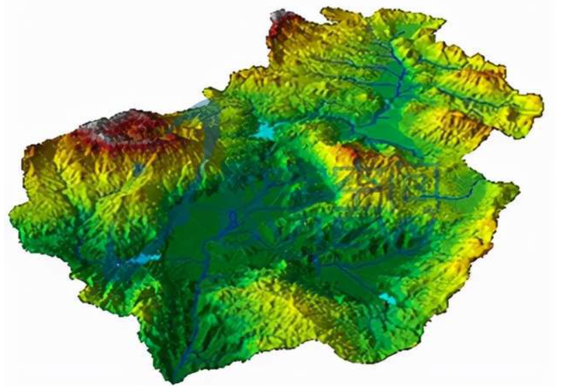

# 3维数据认知——地形影像

在`3维`的开发过程当中,常常会有一大堆的数据。那么这些数据是怎么来的呢？或者说是有哪些平台的数据能够生成3维的效果呢？本次带着大家来看看常用的一种`3维`模型——地形影像。

这里主要分为以下几个部分：

- [**地形影像**是什么](#概念)？
- [**地形影像**生成的途径](#生成途径)？
- [**地形影像**能用来做什么](#用途)？
- 拓展——地图影像数据

# 概念

打开`google`,直接搜索地形影像，发出现如下的结果。

简单的说就是地图的照片，我们都知道，地形一般来说会有高低起伏的。有了高低起伏，那么怎么在计算机的世界中来描绘它呢？

> 在二维里面来构建一个三维的空间，就可以描述对应的地形影像啦😉😉😉

# 生成途径

可以看到上面的图片都是展示在二维的世界当中，如果需要突显三维的地形，那就会使用到 **数据高程**`DEM(Digital Elevation Model)`,那就可以理解成一个**二维的地图数据**+**高程数据**=**三维的地形**，(前提是二维地图数据和当前的数据高层具有某种联系。)

## 数字高程模型(DEM)

数字高程模型（Digital Elevation Model)，是通过有限的地形高程数据实现对地面地形的数字化模拟（即地形表面形态的数字化表达）。**它是用一组有序数值阵列形式表示地面高程的一种实体地面模型**，是数字地面模型(Digital Terrain Model，简称`DTM`)的一个分支，其它各种地形特征值均可由此派生。

> 值得注意的是，虽然通过DEM通常表现出的是地理空间的图像形态，实际上，**它是一种数字阵列信息模型**（x,y,z)，描述地理空间中的地形高低起伏，通过表示模型和渲染后，成为人们看到的地形图。可以简单的理解成`DEM`里面包含了二维地图数据中`h`（高度）

**DEM是研究分析地形、流域、地物识别的重要原始资料**

# 用途

（1）储存大范围的数字化地形数据用于制作基本地图；
（2）各种建设工程的填挖方计算；
（3）军事上的武器自动引导，作战训练模拟；
（4）风景景观分析、通视分析。
（5）道路纵断面坡度分析，水库坝址选择（库容量估计和淹没范围估计）；
（6）通过统计对不同的地形、地貌进行比较，供科学研究用；
（7）计算坡度、坡向，研究日照、雨水排泄、土壤侵蚀等；
（8）将地形和其他信息综合起来，进行土地评价；
（9）用三维图形图像方法对地形的起伏变化进行模拟；
（10）把“高程”（即第三维）换成其他数据，成为其他非地形性质的三维表面模型。

# 拓展

在**二维地图数据**+**高程数据**=**三维地形数据**这个过程中，二维地图长啥样子呢，联系又是啥呢？

……未完待续
