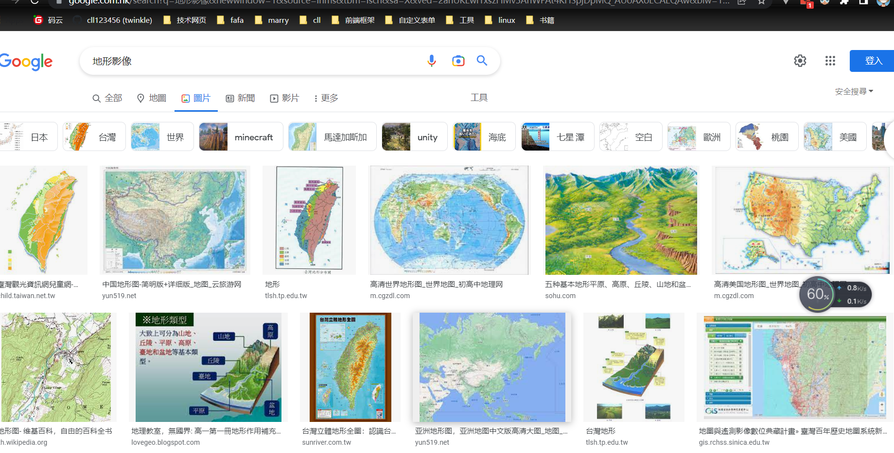

# 3维开发数据认知——地形影像

在`3维`的开发过程当中,常常会有一大堆的数据。那么这些数据是怎么来的呢？或者说是有哪些平台的数据能够生成3维的效果呢？本次带着大家来看看常用的一种`3维`模型——地形影像。

这里主要分为以下几个部分：

- [**地形影像**是什么](#概念)？
- **地形影像**数据生成的途径？
- **地形影像**数据能用来做什么？

# 概念

打开`google`,直接搜索地形影像，发出现如下的结果。

简单的说就是地图的照片，然而每一种地形的图片

