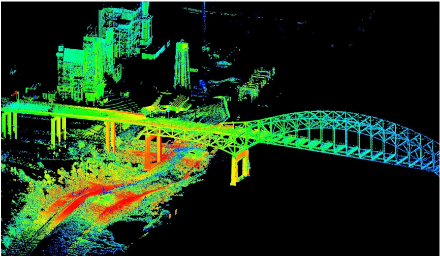

# 3维数据认知——点云

- [什么是点云](#概念)
- [从何而来](获取点云的途径)
- [点云作用](#作用)
- [数据分析](#数据分析)

# 概念

在[逆向工程](https://baike.baidu.com/item/逆向工程/5097433)中通过测量仪器得到的**产品外观表面的点数据集合**也称之为**点云**，通常使用三维坐标测量机所得到的点数量比较少，点与点的间距也比较大，叫**稀疏点云**；而使用[三维激光扫描仪](https://baike.baidu.com/item/三维激光扫描仪/5796256)或照相式扫描仪得到的点云，点数量比较大并且比较密集，叫**密集点云**。简单点的说就是**一群点在三维空间组成的模型**。来看张图：

# 获取点云的途径

- **三维激光雷达扫描**:`LiDAR`（Light Detection And Ranging）激光探测与测量获取的就是点云数据，主要有： 星载、机载和地面

- **三维模型逆向点云**：之所以叫逆向点云，就是本来三维模型通过行、列扫描的形式同样可以获取到三维点云数据
-  **二维影像三维重建**:摄影测量就是将二维影像通过一系列计算可以获取高精度的三维模型，在这一过程中我们同样可以获取点云数据。

# 作用

- **三维重建**: 高精度三维点云数据通过算法拟合生成曲面，用于三维建模，精度高，细节更精细，同时，建模速度快；
- **规划设计**: 大规模的点云数据，是规划设计的利器，高精度实时快速的三维场景，更能直观的展示设计；
- **考古与文物保护**：高精度的点云数据早已应用在文物保护行业。

# 数据分析

点云的数据格式为`.las`.

`LAS文件格式`是一种用于交换三维点云数据的公共文件格式，由美国摄影测量和遥感学会（[ASPRS](https://www.asprs.org/)）维护。该格式不仅可以用于激光雷达点云数据，还支持其他任何**三维xyz元组**。

​    该格式是专有系统或通用ASCII文件交换系统的替代方案，专有系统的问题很明显：数据不能轻易地从一个系统转移到另一个系统。ASCII 文件交换有两个主要问题。第一个问题是性能，因为ASCII高程数据的读取和解析可能非常慢，即使对于少量数据，文件也可能非常大。第二个问题是所有特定于激光雷达数据的信息都丢失了。LAS文件格式是一种二进制文件格式，不复杂，也可保留激光雷达性质所特有的信息。ASPR委员会于2011年11月14日批准了LAS 1.4规范，该规范是该文件格式的最新批准版本，目前最新版本是ASPRS_LAS_v1.4(R15)，发布于2019年7月9日[1]。

