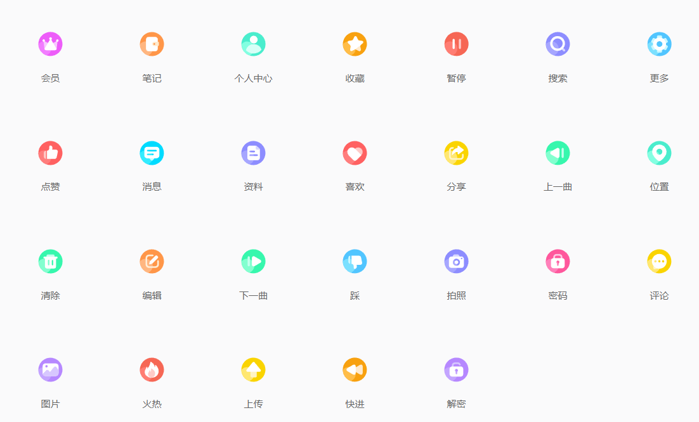

# 3维数据认知——矢量

- [什么是矢量](#概念)
- [矢量的特点](#特点)
- [矢量在三维的应用](#应用)
- [矢量的表现形式](#数据表现形式)

# 概念

一说到矢量，大家可能都不陌生。矢量是啥，用自己的话说就是在**有大小和方向的量**，这就话不好理解，在前端开发中会用到许多的图标，那些图标放大和缩小都不会导致失真的图标就是矢量图标。来一张图：

> **矢量**（英语：**Vector**）是数学、物理学和工程科学等多个自然科学中的基本概念，指一个同时具有大小和方向的几何对象，因常常以箭头符号标示以区别于其它量而得名。直观上，矢量通常被标示为一个带箭头的线段。线段的长度可以表示矢量的大小，而矢量的方向也就是箭头所指的方向。物理学中的位移、速度、力、动量、[磁矩](https://baike.baidu.com/item/磁矩)、[电流密度](https://baike.baidu.com/item/电流密度)等，都是矢量。与矢量概念相对的是只有大小而没有方向的标量。

# 特点

矢量文件中的图形元素称为**对象**。每个对象都是一个自成一体的实体，它具有颜色、[形状](https://baike.baidu.com/item/形状)、轮廓、大小和屏幕位置等属性。既然每个对象都是一个自成一体的实体，就可以在维持它原有清晰度和弯曲度的同时，多次移动和改变它的属性，而不会影响[图例](https://baike.baidu.com/item/图例)中的其它对象。这些特征使基于矢量的程序特别适用于**图例**和[三维建模](https://baike.baidu.com/item/三维建模)，因为它们通常要求能创建和操作单个对象。基于矢量的绘图同分辨率无关。这意味着它们可以按最高分辨率显示到输出设备上。

# 3维中的应用

既然矢量的程序特别适合三维建模，那具体会体现在哪里呢？

 由于矢量基于屏幕空间,所以具有像素级的精度,不会出现传统的基于纹理方法所产生的绘制走样现象;而且不受地形几何数据的约束,其执行效率与地形数据的复杂度无关,仅取决于矢量数据本身的复杂度。主要有以下应用：

- **金属矿山的探测**
- **城市轨道交通工程**
- **数学，物理方面模型的研究**

# 数据表现形式

` DXF `是一种开放的矢量数据格式，可以分为两类：`ASCII`格式和二进制格式；`ASCII`具有可读性好的特点，但占用的空间较大；二进制格式则占用的空间小、读取速度快。各种 CAD 软件中 DXF 被广泛使用，成为事实上的标准。绝大多数CAD系统都能读入或输出DXF文件。

