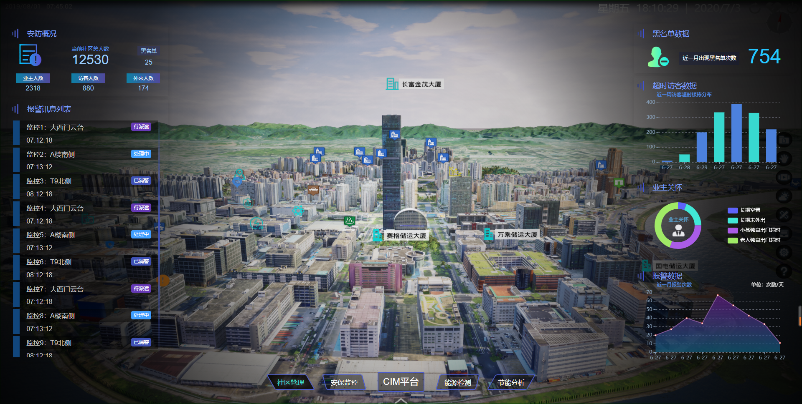
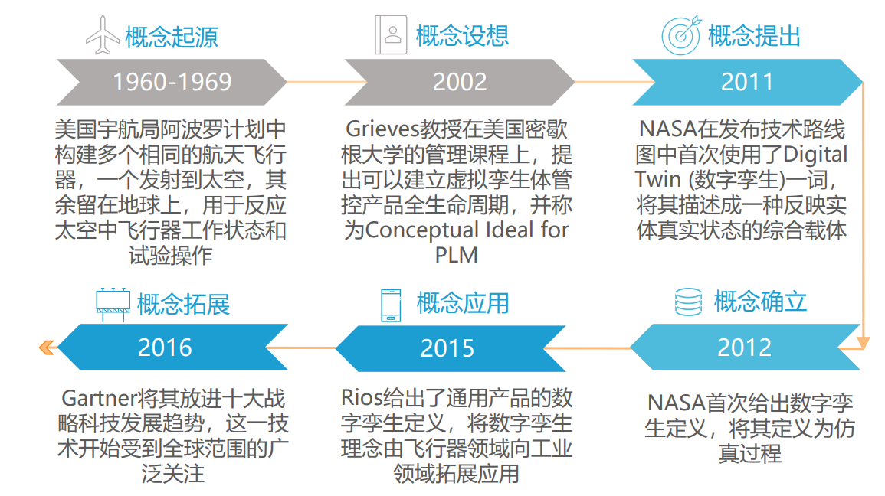
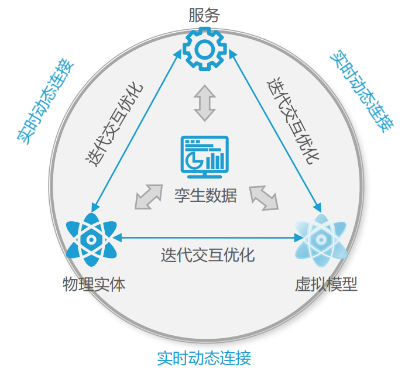

# 数字孪生

## 概念

数字孪生，英文名叫**Digital Twin**（数字双胞胎），也被称为数字映射、数字镜像。在中国通信院发布的期刊中可以看到这么一段话：

> **数字孪生**是充分利用物理模型、传感器更新、运行历史等数据，集成多学科、多物理量、多尺度、多概率的仿真过程，在虚拟空间中完成映射，从而反映相对应的实体装备的全生命周期过程。

简单的来说是**实时仿真+传感数据**

> 上图是某地区的一个结合数字孪生的一个智慧社区的应用。给某个地区构建一个`3D`模型，可以实时拿到传感器的数据。协助管理社区的管理，安保监控等。

## 发展史

**起源于航天、工业领域，由“孪生体”向“数字孪生体”发展 **。*“建立一个孪生体，用于管控实体的运行状态”*这一理念最早起源于美国“阿波罗”计划， 工程师们在地球上建立了与发射到太空上的飞行器一模一样的航天飞行器，用于反映其工作 状态并帮助工作人员进行操控演示。随后， `Grieves教授`在美国密歇根大学的管理课程上提 出可以建立虚拟孪生体来管控产品全生命周期。

具体的年度发展流程如下：

> 但是真正开始应用于商业的是在2017年

**2017年后数字孪生概念逐步丰富，核心是建立与物理实体实时映射的虚拟数字体**

`NASA`提出数字孪生概念后，被多家企业、研究机构广泛使用，并在使用范围、概念内涵上 逐步拓展。数字孪生不仅限于基于物联网的动态模型软件，而是涵盖更多技术体系、延伸到 更多更复杂领域，但其本质仍是**建立与现实体一一映射，反映现实体状态的数字孪生体**。

## 组成部分

**“数字孪生”强调虚实交互，由`PE`、`VE`、`Ss`、`DD`、`CN`五维结构构成**

> 数字孪生技术综合利用**感知**、**计算**、**建模**等信息技术，建立与现实世界实时映射，虚实交互的虚拟世界。数字孪生需要具有**五维结构**：**物理实体**(**P**hysical **E**ntity) 、**虚拟实体**(**V**irtual **E**ntity) 、**服务**(**S**ervice**s**) 、**孪生数据**(**D**igital Twin  **D**ata)和**连接**(**C**onnectio**n**) 。

- **物理实体**：物理实体是数字孪生的基础，通过在物理实体上部署**传感器**等基础设施，监测其环境数据和运行状态。

- **虚拟实体**：物理实体的虚拟化数字镜像，通过**几何**、**物理**、**行为**、**规则**等多种模型相互加成以表现物理实体实时状态及变化。

-  **服务**：集成各类信息系统，为物理实体和虚拟模型提供**智能计算**、**运行**和**管控服务**。 

- **孪生数据**：是建立虚拟孪生体的核心，包括以上三维度所有信息数据，并随着**物理实体的运行实时更新，推动整体数字孪生体系运转，也是数字孪生系统的核心驱动**。

- **连接**：将各维度之间彼此连接，进行有效的实时数据传输，实现一一映射。

这五维结构是仅仅相连，关系如下：

## 应用

数字孪生在各行各业都有不同的作用。例如：

- 大型建筑或海上钻井平台的物理结构可以通过数字孪生进行改进;
- 制造业中的产品从设计到制作再到成品,这之间的所有步骤都可以在数字孪生的辅助下进行 ;
- 汽车具有复杂的工作系统以及协同机制,相应的设计难度非常大,而数字孪生的引入可以在汽车设计的过程中,既提高车辆性能,又提高生产效率 ;
- 数字孪生还有助于设计和规划结构复杂、用途多样的太阳能农场;
- 在城市规划领域,数字孪生可以实时显示`3D`空间数据 ;
- 在医院,得益于数字孪生,患者可以获 得更为优质的医疗保健服务,医生们则可以根据传感 器生成的数据来追踪患者的各项健康指标,进而做出 更精准的判断;
- 在科研院所,科研人员可以利用数字孪生系统生成的大量数据进行更为全面和深入的研 究,并据此对试验进行优化,实现更高效的方案设计。

## 参考文献

[1] 《数字孪生技术在光网络中的应用与问题》.朱康奇，华楠， 李艳和郑小平.

[2]  《2021中国数字孪生城市研究报告》

